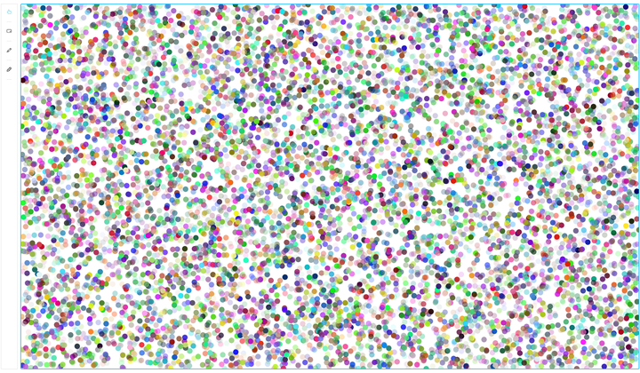
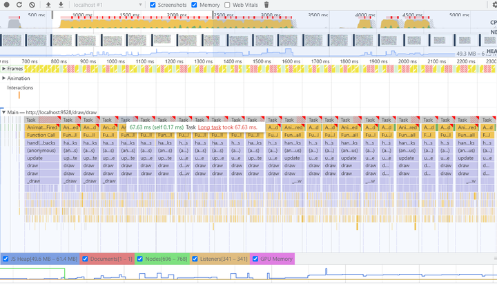
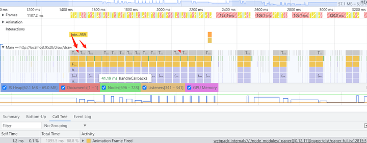

<!--
 * @Author: Hhvcg
 * @Date: 2023-04-12 14:02:07
 * @LastEditors: -_-
 * @Description: 
-->
## web图形化编程之浏览器的极限测试
- 1. **本文档目的**： 测试并记录目下，浏览器单页面的极限图形数量。
- 2. 这里图形数量的极限测试，不是单纯的页面**绘制**最大图形数，还需要在支持拖拽和缩放的操作时，保持**页面流畅丝滑不卡顿**。即:`同一时刻，丝滑交互的最大重排重绘的图形个数`
- 3. 测试环境，默认为谷歌浏览器，绘图工具图形库（paperjs）。

业务场景： 
1. 初始化时须在canvas上绘制缺陷的图形信息（包含缺陷框、缺陷名称等八个部分组成）
2. 画布支持拖拽和缩放事件操作，触发底层`unpdate`和`draw`函数，更新视图

影响性能的两个关键指标： `第一点的绘制耗时，第二点的由事件触发的更新耗时`

#### Circle类
- 测试代码
```
  for (let i = 0; i < 10000; i++) {
    const c = new paper.Path.Circle({
      center: this.random(),
      radius: 10,
      fillColor: getRandomColor()
    })
  }
```
 - 界面： 


 - **测试结果1：** 10000个图形绘制耗时在130ms左右，更新耗时50至70ms。耗时已靠近50ms限制的`长任务`的边缘，如下图所示。视觉层面的变现，会略微感知“卡顿”

 - 多次测试发现`更新`函数耗时为`初始绘制`耗时的一半。
 - **测试结果2** 为了将`更新`函数耗时压缩至50ms以下，测试8000个图形。`绘制`耗时100ms，`更新`耗时基本 <= 50ms,视觉层面相较前一种更加流畅


### pointText

```
  for (let i = 0; i < 8000; i++) {
    const defectName = new paper.PointText({
      point: this.random(),
      content: 'ceshi',
      justification: 'center',
      fillColor: getRandomColor()
      // fontWeight: 'bold'
    })
  }
```
个数8000个，`绘制`耗时60ms，`更新`耗时与`绘制`的耗时基本持平。可见文本相较于图形速度更快

### Rectangle类
```
  for (let i = 0; i < 8000; i++) {
    const defectBorder = new paper.Path.Rectangle({
      center: this.random(),
      size: new paper.Size(10),
      fillColor: getRandomColor()
    })
  }
```
矩形跟圆的耗时相近不赘述。


### 极限测试的结论
`通过上面的测试，我们基本可以认为，以目下谷歌浏览器的能力，如果既要足够快的在画布上绘制出图形，同时还要支持在对画布进行缩放、拖拽操作时能够避免卡顿。10000个图形几近极限。8000个图形较为合适。`根据此结论，我们可以将8000作为单页面支持图形个数的`阈值`。按照这个阈值，根据本业务的实际场景，单通道分配到的图形个数在4000，又因为一个缺陷的信息，实际上是一系列图形组成的集合，因此实际支持的缺陷个数应该控制在`500个`，应用最佳。


<!-- - `setSelectedCenter`方法，很诡异，时而影响时而不影响，暂未查明`
- 图片应该先于缺陷信息，优先加载 -->