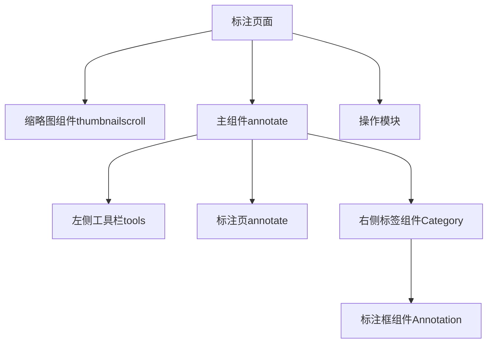

# 前端开发文档
## 一. 安装软件包

``` javascript
cnpm install
cnpm run dev
```
<font face="微软雅黑">建议1：node版本过高安装会有问题，建议安装14.17.1版本<font>  
<font face="微软雅黑">建议2： 使用yarn或者cnpm</font>

## 二. 项目架构说明
### 1. 技术选型
前端框架： vue2  
路由 vue-router  
数据存储 vuex  
UI组件库 IView + ElementUI  
标注界面使用第三方库 [PaperJS](http://paperjs.org/)  
HTTP请求 axios 
数据可视化 echarts  
国际化库 vue-i18n(暂未使用)
...待补充  

### 2. src文件目录
```javascript
|-- root
    |-- .env
    |-- .eslintignore
    |-- .eslintrc.js
    |-- .gitignore
    |-- public
    |   |-- favicon.ico
        ...
    |-- src
    // 主入口文件
    |   |-- App.vue
    |   |-- main.ts
    // vuex
    |   |-- store
    // 路由设置
    |   |-- router
    // 公共样式等
    |   |-- styles
    |   |-- utils
    // 公共组件库文件
    |   |-- components
            ...
            // 标注工具的所有功能组件
    |   |   |-- annotator
                // 标注框,所有标注框信息存储与其中的compoundPath变量
    |   |   |   |-- Annotation.vue
                // 标注标签
    |   |   |   |-- Category.vue
    |   |   |   |-- CustomShortcut.vue
    |   |   |   |-- FileTitle.vue
    |   |   |   |-- Label.vue
    |   |   |   |-- panels
                    // 标注工具按钮组件
    |   |   |   |   |-- BBoxPanel.vue
    |   |   |   |   |-- BrushPanel.vue
                    ...
                    // 标注工具实现逻辑组件
    |   |   |   |-- tools
    |   |   |       |-- AnnotateButton.vue
    |   |   |       |-- auditModal.vue
    |   |   |       |-- BBoxTool.vue
                    ...
                ...
            ...
        ...
    ...
    // 各模块的接口文件
    |   |-- apis
    |   |   |-- auth.ts
            ...  
        // 各模块页面代码文件 
    |   |-- pages
    |   |   |-- account
    |   |   |-- dashboard
        // paperjs工具标注模块
    |   |   |-- detection
                // 标注核心组件
    |   |   |   |-- annotate.vue
                // 标注页面首页
    |   |   |   |-- index.vue
    |   |   |   |-- mask.vue
                // 公共方法
    |   |   |   |-- mixins.js
    |   |   |   |-- navCard.vue
    |   |   |   |-- navigation.vue
                // 单张标注
    |   |   |   |-- single.vue
                // 标注页面底部缩略图列表
    |   |   |   |-- thumbnailScroll.vue
    |   |   |   |-- components
    |   |   |       |-- annotateMask.vue
    |   |   |       |-- AnnotationMask.vue
    |   |   |       |-- CategoryMask.vue    
            // 分类标注模块
    |   |   |-- detectionClassify
            // 模型模块,包含模型训练和模型评估 
    |   |   |-- models
    |   |   |   |-- mixins.js
    |   |   |   |-- modelCreate.vue
    |   |   |   |-- modelList.vue
    |   |   |   |-- publishData.vue
    |   |   |   |-- trainCreat.vue
                ...    
            ...
        ...
    ...
  
```

### 3. 配置后端地址及联调接口相关
```javascript
// .env文件
...
VUE_APP_DOMAIN_DEV_V3= http://192.168.10.12:10701
...

```
```javascript
// vue.config.js文件配置代理,目前项目中的接口api，存在两种前缀：/api/v1和/carpo/api/v1
// 对接不同后端同学时，可在此做相应地址的更改。
...
proxy: {
    '/api/v1': {
        target: process.env.VUE_APP_DOMAIN_DEV_V3,
        // target: 'http://192.168.10.12:10801',
        changeOrigin: true
    },
    '/carpo/api/v1': {
        // target: 'http://192.168.10.12:10801',
        target: process.env.VUE_APP_DOMAIN_DEV_V3,
        changeOrigin: true
    }            
},
...
```

### 4. 标注模块的功能实现逻辑
工具标注页面


分类标注，流程同上面类似，只是工具栏操作废弃，改为视图切换功能


### 5. 代码规范
```javascript
    1). 单个组件代码尽量不要超过400行
    2). 组件名称多个单词，遵循驼峰规则，描述结构"名称+动词"
    3). 紧密耦合的组件名应带上父组件名称
    4). 多个 attribute 的元素应该分多行撰写，每个 attribute 一行
        <MyComponent
            foo="a"
            bar="b"
            baz="c"
            />
    5). 提交commit备注规则：
        git commit -m '备注'
            add: 添加新功能
            type: commit的类型
            feat: 新特性
            fix: 修改问题
            refactor: 代码重构
            docs: 文档修改
            test: 测试用例修改

```
### 6.vscode第三方插件
GitLens: git工作流的绝佳搭配，最新的包括git记录可视化功能  
koroFileHeader: 用于生成文件头部注释和函数注释

...  
...  
... 有待补充 +_+
